<!-- omit in toc -->
# T3A2-A Full-Stack App (Part A)
<!-- omit in toc -->
## Desperate Housewares App
<!-- omit in toc -->
### Table of Contents
- [Problem Identified](#problem-identified)
- [Purpose](#purpose)
- [Target Audience](#target-audience)
- [User Stories](#user-stories)
  - [Customers (users and shoppers):](#customers-users-and-shoppers)
  - [Administrator:](#administrator)
  - [Staff member:](#staff-member)
  - [Non-MVP User Stories:](#non-mvp-user-stories)
- [Features](#features)
- [Tech Stack](#tech-stack)
- [Dataflow Diagram](#dataflow-diagram)
- [Application Architecture Diagram](#application-architecture-diagram)
- [**Wire frames**](#wire-frames)
  - [**Homepage Design:**](#homepage-design)
    - [Homepage Phone View](#homepage-phone-view)
    - [Homepage Tablet View](#homepage-tablet-view)
    - [Homepage Desktop View](#homepage-desktop-view)
  - [**Held Listings Page Design:**](#held-listings-page-design)
    - [Held Listings Phone View](#held-listings-phone-view)
    - [Held Listings Tablet View](#held-listings-tablet-view)
    - [Held Listings Desktop View](#held-listings-desktop-view)
  - [**Admin Dashboard Page Design:**](#admin-dashboard-page-design)
    - [Admin Dashboard Phone View](#admin-dashboard-phone-view)
    - [Admin Dashboard Tablet View](#admin-dashboard-tablet-view)
    - [Admin Dashboard Desktop View](#admin-dashboard-desktop-view)
  - [**Modal Designs**](#modal-designs)
    - [Add Staff Modal](#add-staff-modal)
    - [Change Password Modal](#change-password-modal)
    - [Delete Account Modal](#delete-account-modal)
    - [Manage Account Modal](#manage-account-modal)
    - [Manage Listing Modal](#manage-listing-modal)
    - [Sign In Modal](#sign-in-modal)
    - [Sign Up Modal](#sign-up-modal)
  - [**Menus Design:**](#menus-design)
    - [Hamburger Menu](#hamburger-menu)
    - [Settings Menu](#settings-menu)
    - [Shopping Cart Menu](#shopping-cart-menu)
- [Trello Board Progress](#trello-board-progress)
- [References](#references)

### Problem Identified

People do not know what is in an op shop until they go in there, and most of the time you need to browse in several stores until you find a desired product. For convenience people trend to go to bigger op shops, which normally belong to a chain of stores, leaving only a small portion of the market share for the community stores. Due to the limited market presence and visibility, those smaller op shops sometimes end up not having enough volume of sales to become a sustainable business that continuous to support the local economy and the underprivileged customers.

### Purpose

This web application has the main purpose of giving a better market visibility to small op shops by displaying their catalogue of products to be easily accessed by their customers, who can verify online if their local store has the items they are looking for and complete the purchase for pick up, saving time and money in their purchasing process, as it eliminates the need to physically go and browse for an item in several different stores.

### Target Audience

* Customers - local community, underprivileged people
* Small op shops - administrator and general staff

### User Stories

#### Customers (users and shoppers): 

* As a user, I want to be able to view a store's list of products or catalogue so that I can find an item.

* As a user, I want to be able to delete my account because I no longer want to use this service.

* As a user, I want to be able to sign up/create account so I can utilise the website features.

* As a user, I want to be able to delete my account because I no longer want to use this service.

* As a user, I want to be able to update my account so that changes in my details are current.

* As a user, I should be able to log into my account so that I can use the website as desired.

* As a shopper, I want to be able to view listings I have placed on hold so that I can manage them. 

* As a user, I want to be able to recover my password so that I can log in if I forget it.

* As a shopper, I want to be able to view listings I have placed on hold so that I can manage them. 

* As a shopper, I want to be able to pay online for a listing item so that it can be held at the store for me to collect. 

* As a shopper, I want a confirmation email for the product so that I know all the details.

#### Administrator:

* As an administrator, I want to be able to add a user to a store as staff so that they can post product listings in the store's catalogue. 

* As an administrator, I want to be able to do all the things that a staff member can do so that I can also perform staff tasks.

* As an administrator, I want to be able to remove staff from the store because they no longer work there. 

#### Staff member:

* As a staff member, I want to be able to add products to a store's catalogue so that shoppers can place an order on them.

* As a staff member, I want to be able to see a list of products on hold so that they can be organised for the shopper. 

* As a staff member, I want to be able to remove product listings so that they are no longer shown on the stores catalogue.

* As a staff member, I want to be able to update a products listing so that changes can be added/removed from the listing.

#### Non-MVP User Stories: 

* As a user, I want to be able to view a list of stores so that I can find a store close to me. 

* As a user, I want to be able to search a store's catalogue using keywords so that I can find relevant listing items.

* As a shopper, I want to be able to see a calendar for how long I have left to collect an item before it is no longer placed on hold.

* As a shopper, I want to be able to chat to the store's staff about listing items so that I can get more information about them.

* As an administrator, I want to be able to create a store so that it can support its own catalogue. 

* As an administrator, I want to be able to view my sales over a timeframe as well as track transactions so that I can gain insights on my business goals.

* As a staff member, I want to be able to see the items on hold and their details in my calendar so that I can efficiently manage them.

* As a staff member, I want to be able to chat to shoppers who are requesting to find out more information about a listing item.

### Features

* User sign up with allocation of roles
* User authentication and authorisation via JWT and Bcrypt
* Display store catalogue items to all users
* Features exclusive to store employees:
  * Add, edit and delete listing items
  * Add and delete staff members (admin only)
  * View list of items put on hold by shoppers
* Features exclusive to shoppers:
  * Add items into shopping bag for pick up at store

### Tech Stack

Desperate housewives will make use of the following technologies as a part of its architecture and development:
**MERN**

- [**M**ongoDb](https://www.mongodb.com/mern-stack), is a non-relational document database that will be used to store the data required for the websites functions. 
- [**E**xpressJs](https://expressjs.com/), is a server side javascript framework that makes use of Javascript's asynchronous features to handle URL routes and HTTP requests and responses.
- [**R**eactJs](https://reactjs.org/), is a declarative component based javascript framework that will be used on the front end to dynamically render DOM elements into the clients browser. 
- [**N**odejs](https://nodejs.org/en/), is a javascript runtime environment that will be used to run the express API outside of the browser as a server. 

**HTML5, CSS &** [Tailwind](https://tailwindcss.com/)

HTML5 is the markup language used to structure the layout for the webpages in the views generated by rails. 

CSS is a style sheet language that will be used to style the html dom elements.

Tailwind is css framework that will be used to make styling the website more efficient. 

[**MUI**](https://mui.com/)

MUI components is a react library that will be used to make the creation of Modals quicker and easier. 

[**JWT**](https://jwt.io/) **&** [**Bcrypt**](https://www.npmjs.com/package/bcrypt)

JWT (JSON web token) and Bcrypt are both javascript packages that will be used together to handle the secure transfer of user information as well as manage authentication and authorization.  

[**Cloudinary**](https://cloudinary.com/)

Cloudinary is cloud based storage platform that will be used to configure and implement secure upload and storage of images across the website.

[**Netlify**](https://www.netlify.com/?utm_source=google&utm_medium=paid_search&utm_campaign=12755510784&adgroup=118788138897&utm_term=netlify&utm_content=kwd-371509120223&creative=516906172749&device=c&matchtype=e&location=9068943&gclid=Cj0KCQjw5ZSWBhCVARIsALERCvwAkBmIujy1-TOw6iUvUcHDeNQXU07dNqdKqpBl_jsjmmeiQi0VJQ8aAvDVEALw_wcB)

Netlify is a cloud computing platform that will host the applications front end in production.

[**Heroku**](https://id.heroku.com/)

Heroku is a cloud computing platform that will host the applications API in production.

[**Mongoose**](https://mongoosejs.com/)

Mongoose is an object modelling library for node.js that enables schema-based models to be implemented in our server API. 

[**Jest**](https://jestjs.io/)

is a javascript testing framework that will be implemented for our unit testing.

[**Git**](https://git-scm.com/)

Git is an open source version control system that will be used to handle version control.
### Dataflow Diagram
The dataflow diagrams (DFD) reflects the movement of data throughout the program.Rather than have one large diagram, they have been split into multiple DFDs to make understanding them easier.

They have been broken down to specific processes:
- Customer/User
- Staff
- Manager/Admin
- Login/Sign Up
- Cart

The customer/user DFD follows the processes required for the basic usage of the app; Viewing the items, adding the items to their cart, and placing the items on hold. In order for a customer to add an item to their cart they are required to be logged in.

The cart DFD shows the processes involved in either placing an item on hold or removing all items from the cart. Once the items are placed on hold they are removed from the catalogue so they aren't visible to other customers, the items are moved into their orders, and the cart is then cleared. If the user wishes to clear their cart with placing on hold then the cart is simply cleared of all items.

The login/sign up DFD follows the process required for logging in with JWT and Bcrypt. Each step requires some form of verification (all required inputs are provided, if the user exists, etc.). Once the user is verify or the new user is signed up, the user info is stored as a session cookie and provided a token specific to the user and session which can then be accessed for the duration of the session.

The staff DFD reflects the process of adding, editing, and deleting an item. Only staff, managers, and admins have access to these features.

The manager/admin DFD shows that they are the only ones with access to the admin dashboard. The admin dashboard is the only place where the role of an account can be edited (i.e. add or remove staff). They also have access to all features available to staff.

### Application Architecture Diagram

### **Wire frames**

 General Design Choices 

 

This section contains a list of wire frames for all screen widths. Each designed to be mobile first with the intention of the site being accessible to all users. For this reason the design of the website is kept simple and monochromatic to draw attention to button warnings and intended actions across the user interface. 

To keep the website design modern we have decided to use Oswald with varying weights to put emphasis on important content such as headings. Oswald belongs to the Sans-Serif typeface family which is shown to significantly improve the reading performance of individuals with dyslexia. (Luz Rello and Ricardo Baeza-Yates, Good Fonts for Dyslexia, 21 October 2013) This was another important factor in our decision to use Oswald. 

The colors chosen for the website  (excluding white and black) are red, blue and yellow or specifically #B30000, #2555AD and #FAC904 respectively. These colors have been contrast checked using web-aims online contrast checker (see webAIM Screenshots below).

A deeper discussion that outlines design choices such as but not limited to space distribution, relationship between screens (i.e. phone, tablet and desktop designs) content prioritization and intended actions/functions can be found below.

 WebAIM Screenshots 

 

#### **Homepage Design:**

 Homepage Wireframes 

 

##### Homepage Phone View

##### Homepage Tablet View

##### Homepage Desktop View
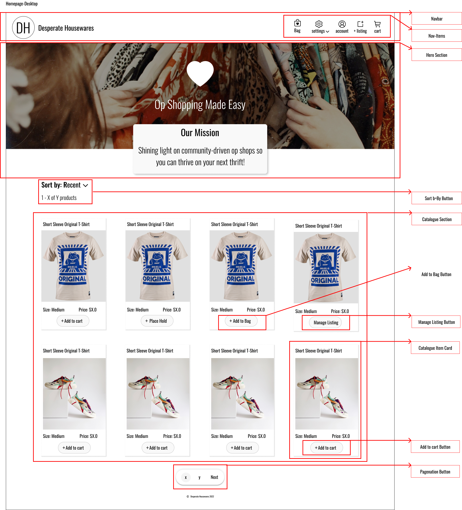

 Homepage Design overview 

 
The homepage is the first thing that the user sees when they enter the website. To emphasize the websites purpose and build reputation we have decided to implement a hero section that contains our mission statement and logo as well as an image with a dark overlay to increase contrast and draw attention to our brand's slogan.

We recognize that the navbar is the anchor point for the website and for this reason it is fixed at the top of the screen for all users so that they can quickly and easily navigate the website. In addition to this you will notice that each nav icon is clearly labelled underneath to communicate the destination point (see intended actions/functions). You will notice that we have chosen to incorporate svg icons with the goal of making the navbar more visually appealing to the stakeholders. Lastly you will notice on small device widths all nav-items except for the cart will be displayed in a hamburger menu.

Nav-Item Actions/Functions (left to right):
 - Desperate Housewares logo; will return the user to the top of the homepage.
 - Bag nav item; will render the Held Listings page.
 - Settings dropdown menu; will open the settings menu.
 - Account nav item: will open the manage account modal.
 - create listing nav item: will open the create listing modal.
 - Cart nav item: will open the shopping cart menu

We recognize that the most common way that users scan our website will follow the F-shaped pattern. For this reason we have decided to go with a standard design for the marketplace catalogue directing their eyes across a series of catalogue item cards. Each cards visual hierarchy is designed to establish the main focal point as the catalogue items image. The secondary focal point is the large "add to cart or add to hold" buttons which will either add the item to the users cart or to the users bag of holdings. It is important to note that as a part of our development process we will be using a hold system and transferring to a payment/cart system later on in the projects lifecycle. For this reason both buttons are shown in the figma designs. 

Additional design considerations that improve the user experience and build upon the sites functionality is:
1.  The "sort by" button, whose purpose is for the user to be able to sort by "price" and "recent" with the goal of adding more sorting options during future development cycles. 
2.  The manage-listing button, which will prompt the manage-listing-modal (discussed further on) and is displayed instead of the add to cart button for staff and administrators so that they can manage (edit, remove) a listing item on the catalogue.
3.  The pagination button, which is designed to improve the user experience and the load time of the website by reducing the amount of listing items required to be displayed at any given time and improve the user's the ability to navigate them. 

#### **Held Listings Page Design:**

Held Listings Page Wire-frames

 

##### Held Listings Phone View
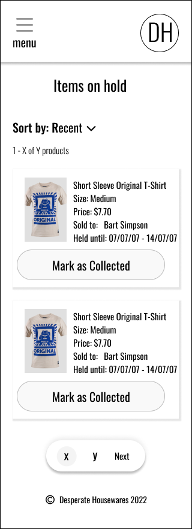
##### Held Listings Tablet View
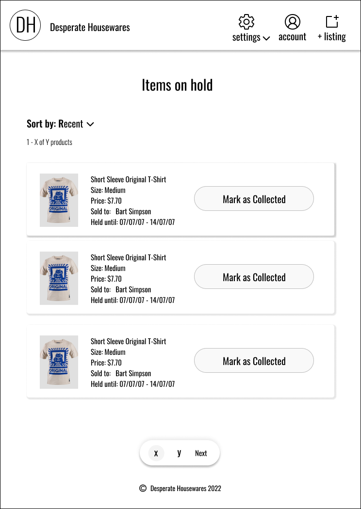
##### Held Listings Desktop View

Held Listings Page Design overview

 

The held listings page is reused for both staff and shoppers and will be rendered in different ways. The differences between what are rendered includes:

1. The shoppers data will be visible for a logged in shopper. (see held listing desktop wire0frame vs tablet wire-frame)
2. The shoppers data will not be visible for a logged in staff member.
3. For shoppers only held items they have placed a hold on will be shown as cards in the held items card collection.
4. For staff, all held items in the store will be shown as cards in the held items card collection. 
5. The mark as collected button on a held item card will not be visible for shoppers and the card size will be reduced.
6. The mark as collected button will be visible for staff.
7. In place of the mark as collected button will be a remove from hold button for shoppers which will remove the card and item from the shoppers bag.

The held listings page can be accessed through the bag button for shoppers or through the settings menu option "view listings on hold" for staff. The purpose of this page is for users to be able to view the holdings relevant to them. You will notice that the design is kept simple and minimal and follows the standard "F" viewing pattern. For accessability the mark as collected button is designed to be large on each card so that the staff member can quickly process a customers hold request. 

Initially the design included a table that documented the holdings in a similar format however to make the website more responsive and reduce load times the held items were turned into cards with a pagination button for easy navigation. 

#### **Admin Dashboard Page Design:**

Admin Dashboard Page Wire-frames

 

##### Admin Dashboard Phone View
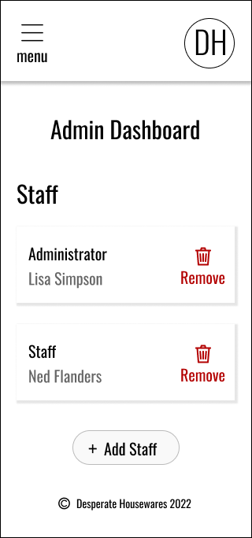
##### Admin Dashboard Tablet View
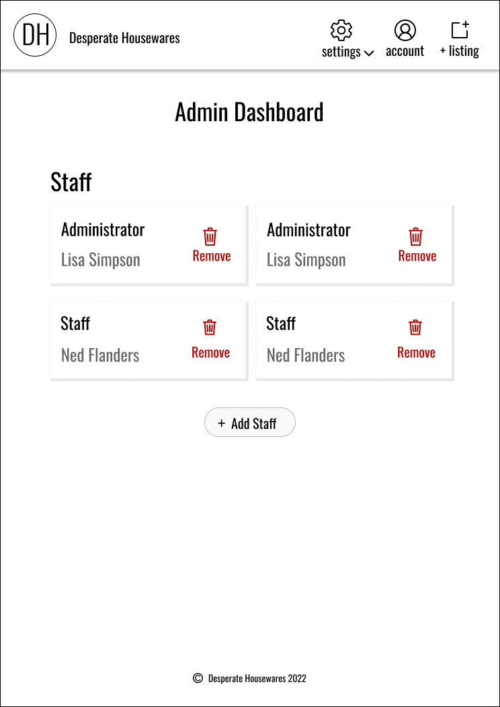
##### Admin Dashboard Desktop View

Admin Dashboard Page Design Overview

 

The Admin Dashboard page is used by an administer to add new staff to the store using the + add staff button or remove staff from the store by clicking the remove icon on the staff card in the staff card collection. This page is designed with simplicity in mind so that in future development cycles more administrative features can be added. For consistency with all other pages this page follows the standard F pattern. You will notice the remove staff icon and button is coloured red. This is to call attention to this feature and act as a warning to the user. 
 

#### **Modal Designs**

Modal Wireframes

 

Add Staff Modal Wire-frames

 

##### Add Staff Modal

Change Password Modal Wireframes

 

##### Change Password Modal
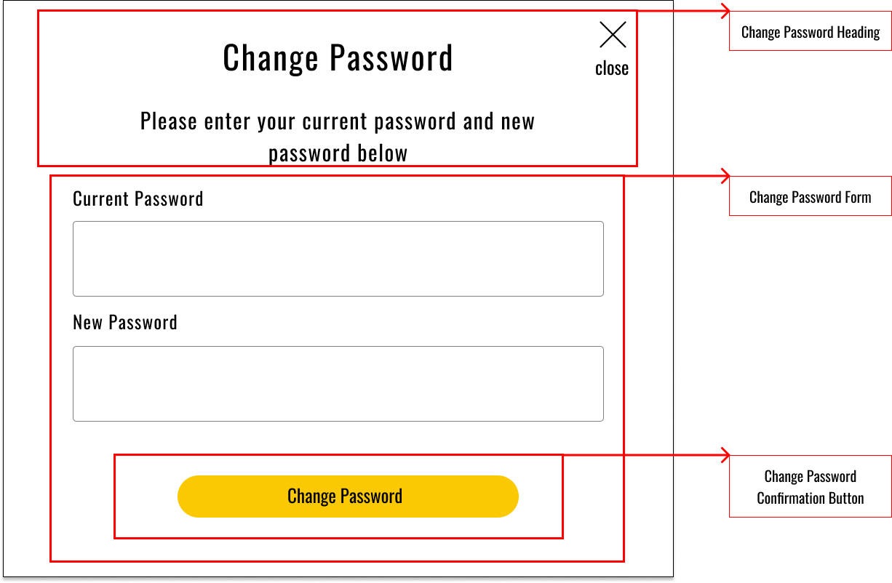

Delete Account Modal Wireframes

 

##### Delete Account Modal
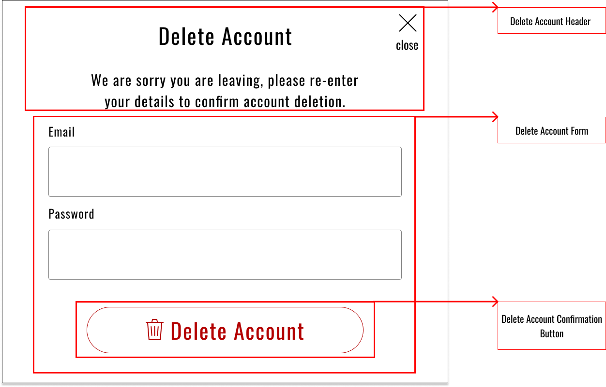

Manage Account Modal Wireframes

 

##### Manage Account Modal
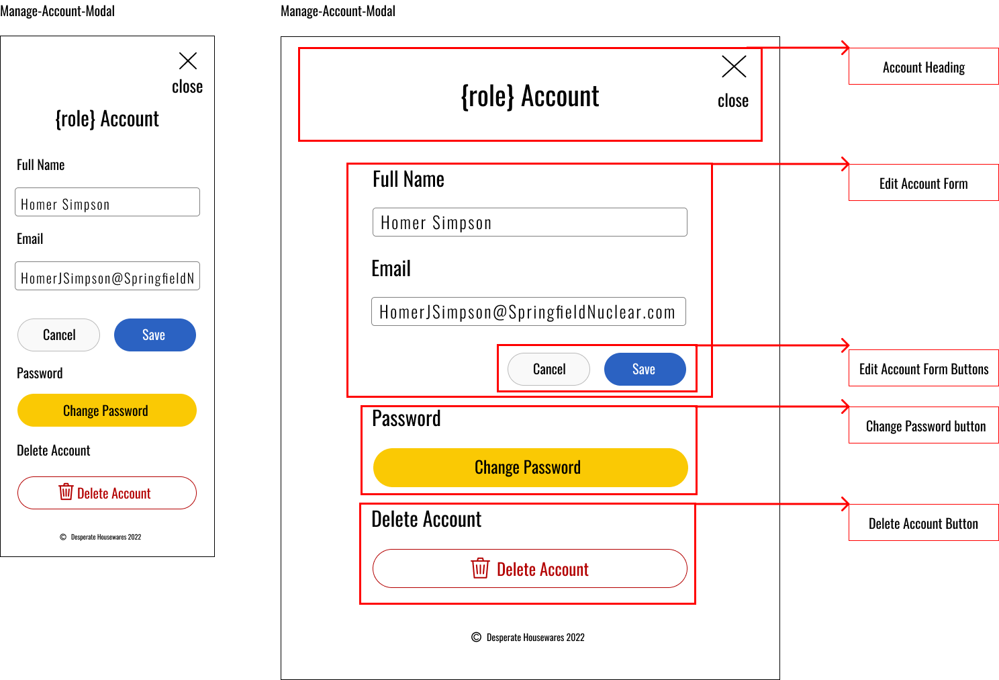

Manage Listing Modal Wireframes

 

##### Manage Listing Modal

Sign In Modal Wireframes

 

##### Sign In Modal
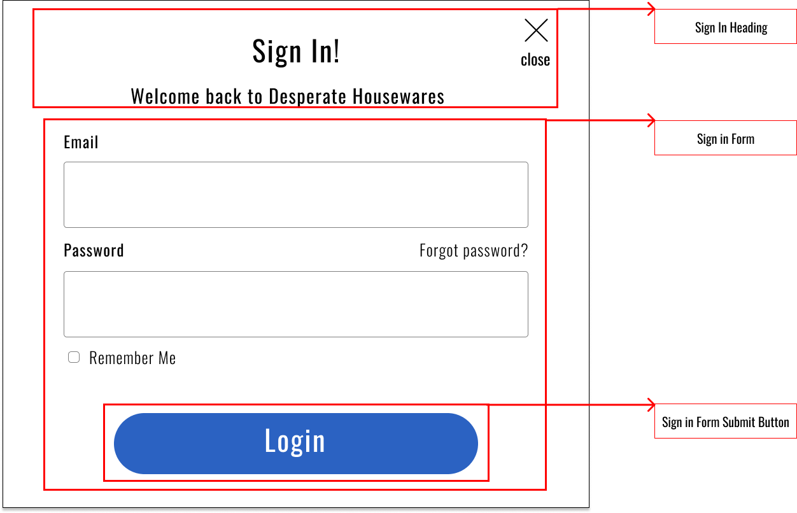

Sign Up Modal Wireframes

 

##### Sign Up Modal
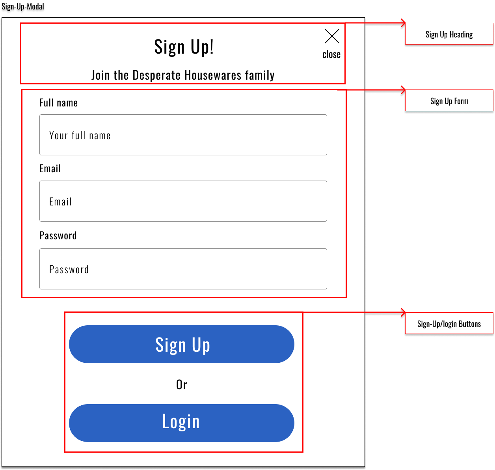

Modals Design Overview

 

To stop the website from being content heavy we have decided to split the forms out into modals. All modals follow the general F patter with large buttons to draw attention to the corresponding actions. Each modal can be closed using the close button with the 'X' icon which is clearly labelled close to indicate it's purpose to the user. Additionally every modal follows the general format listed below with a goal fo providing consistency between modals and simplicity.

1. Header,
2. Fillable Form,
3. Submit/save buttons.

The design of these modals makes responsiveness easy to optimize for mobile screens. Lastly you will notice that all buttons are styled to emphasize warnings and draw attention to their intended function.

#### **Menus Design:**

Menu Wireframes

 

Hamburger Menu Wireframes

 

##### Hamburger Menu

Settings Menu Wireframes

 

##### Settings Menu
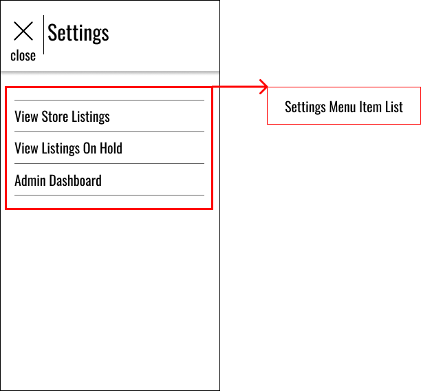

Shopping Cart Menu Wireframes

 

##### Shopping Cart Menu

Menu's Design Overview

 

To meet the criteria of our MVP the design incorporates three menu, these are discussed below. 

**Hamburger Menu:** This menu was designed with simplicity and mobile responsiveness in mind by reducing the complexity of the navbar for mobile widths. Additionally, the position of the hamburger button used to open this menu is located on the left hand side and corresponds with the direction that the hamburger menu will be appear from.

**Settings Menu:** This menu has a similar design to the hamburger menu and is designed with simplicity and mobile responsiveness in mind. The intention of this menu is to act as a place for staff/admin navigation options to be found. On large screen widths this menu will drop down when the settings icon is clicked and for small screen widths it will push outwards like the hamburger menu.

**Shopping Cart Menu:** This menu is designed with simplicity and user experience in mind. The cart is designed to be mobile responsive and appear when the cart icon is clicked. The cart will pop out from the right hand side of the screen for desktop and over the entire screen for mobile widths. On this menu you will notice that the "place hold" button is featured twice. The intention of this is to reduce the users scroll times on small screens. In addition to this you will notice that the remove all button is highlighted red and made distinct to draw attention and act as a warning.

### Trello Board Progress

For our project we have decided to use a implement kanban board with regular meetings and standups. This Kanban board is designed to be used to management the project by following the below steps. 

1. Make User Stories and other project related tasks visible on the board by adding all tasks as cards to the **Backlog** list;

2. Move the cards one-by-one to **To Do** as they becomes more fleshed out while giving preference to the highest priorities;

3. Move card to **In Progress** and assign owner name to the card;
  * Owners need to create a checklist for each of their cards (at least 5 tasks per checklist);

4. Once completed, card is moved to **Review** for final tests to see how that feature is interacting with other ones;
 
5. When tests and/or review are successful, move card to **Completed** and celebrate that win!
 
6. When deployment is achieved, move cards to **Deployed**, celebrate one more time!
 
7. Now it's time to check the **Backlog** for the next task.

Below is a series of screenshots with the progress that we have achieved thus far. 

**04/07/2022**

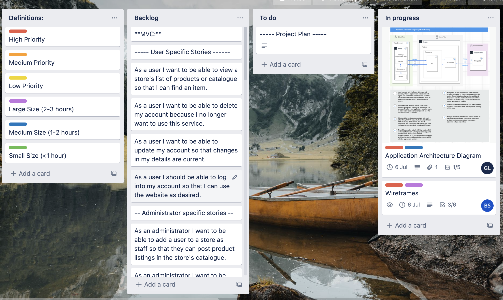
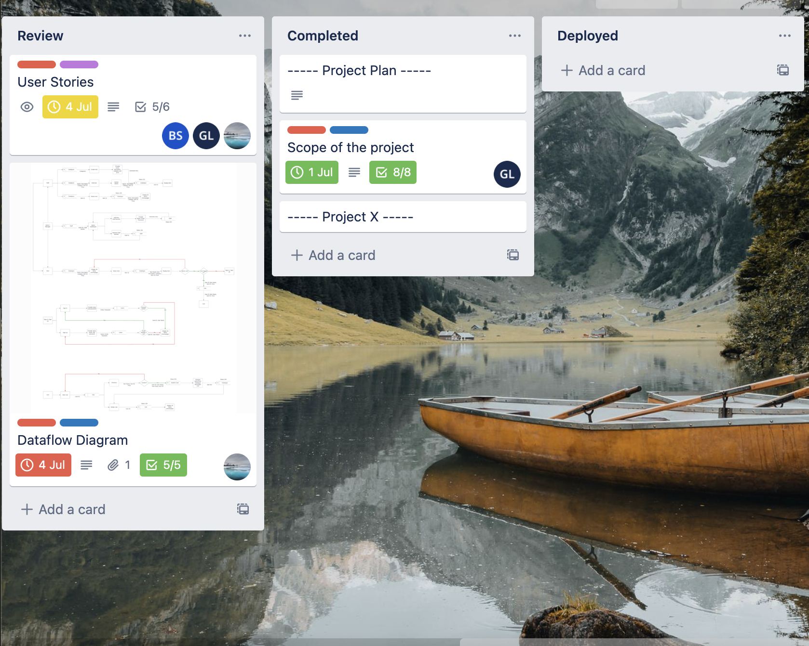

**05/07/2022**

**06/07/2022**

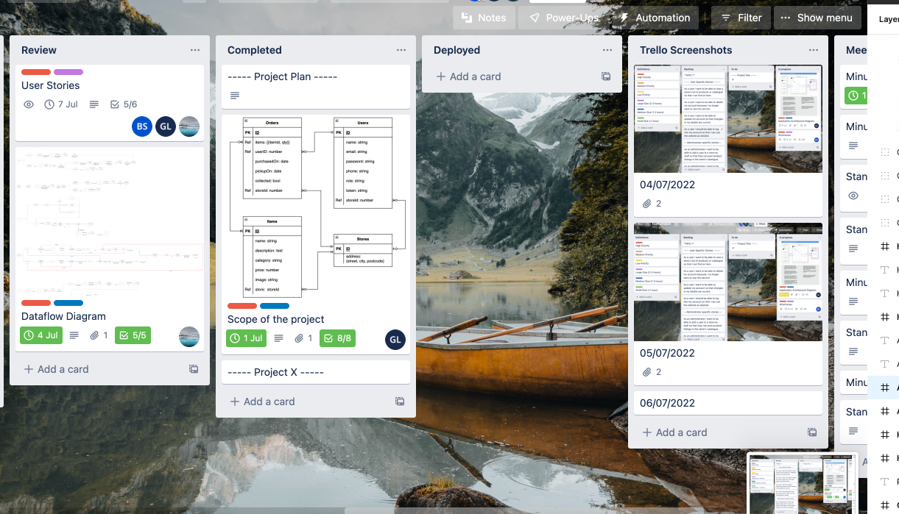

**07/07/2022**

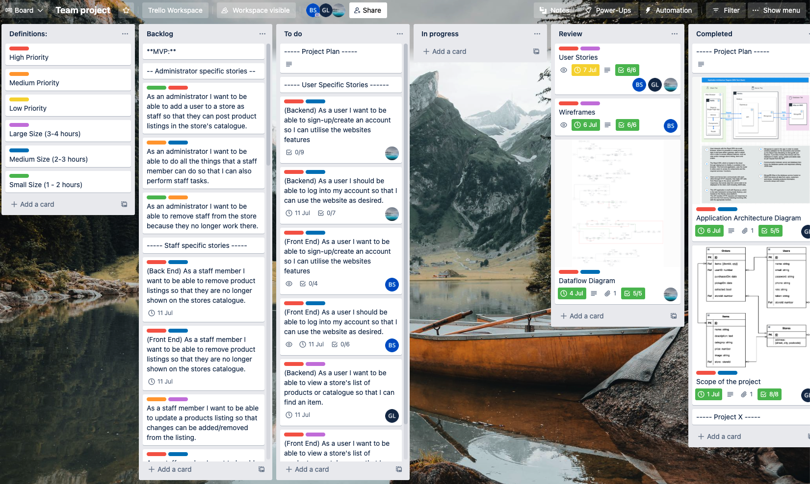
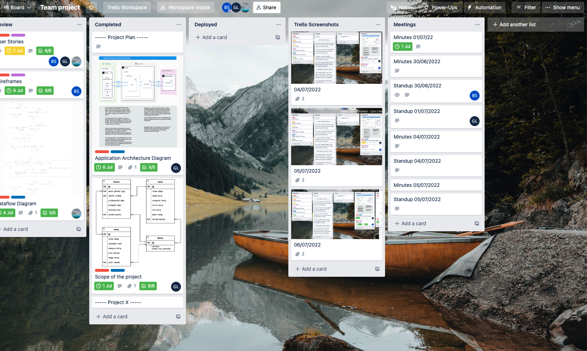

**08/07/2022**

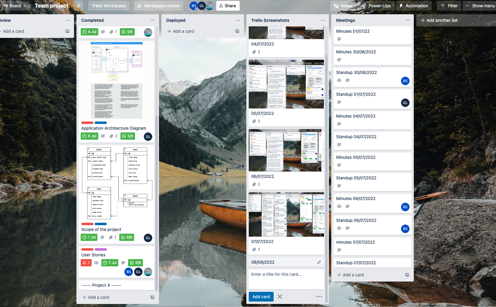

The trello board can be found here: [Desperate Housewives Trello](https://trello.com/invite/b/BzgS0oZt/641fd4be604d47fca55fb75d6d5855c0/team-project)

### References

1. Luz Rello and Ricardo Baeza-Yates, Good Fonts for Dyslexia (21 October 2013), http://dyslexiahelp.umich.edu/sites/default/files/good_fonts_for_dyslexia_study.pdf

